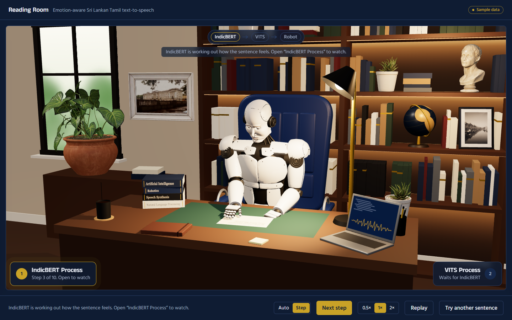
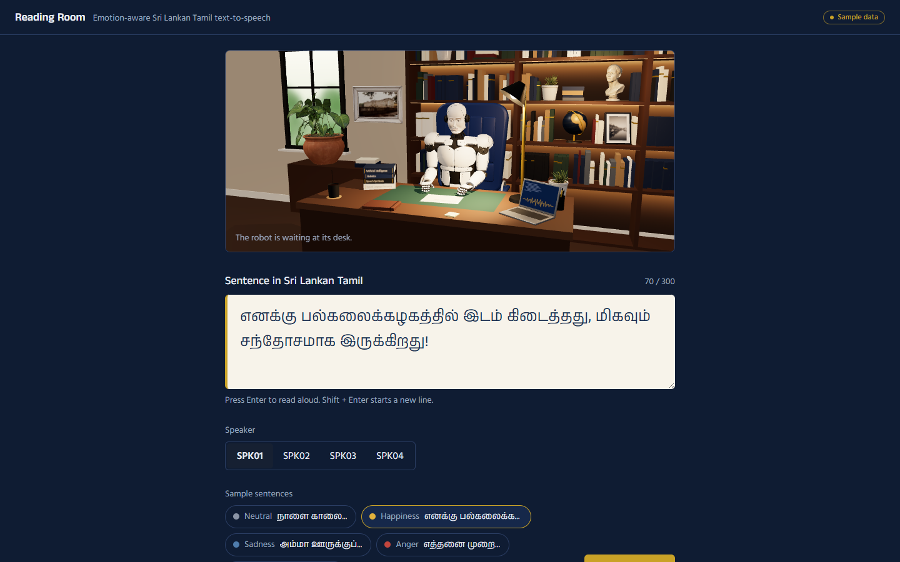
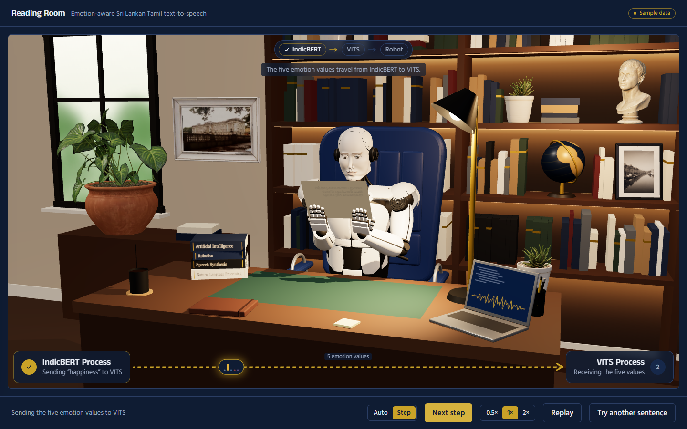
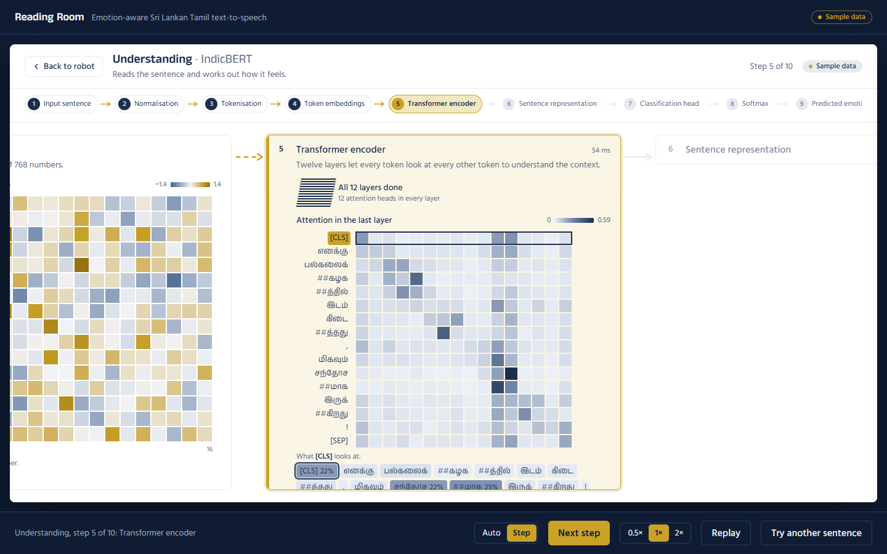
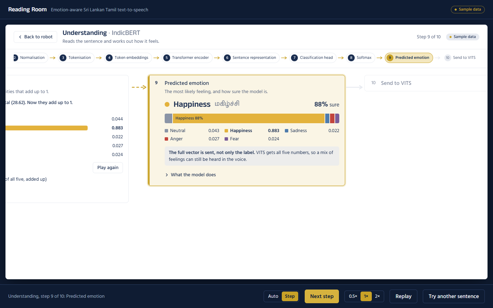
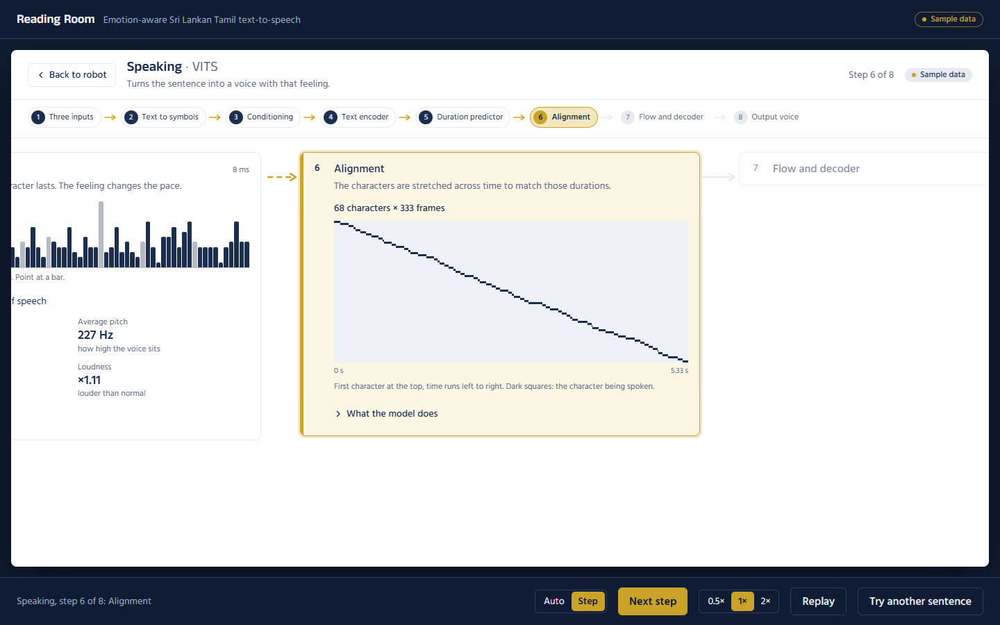
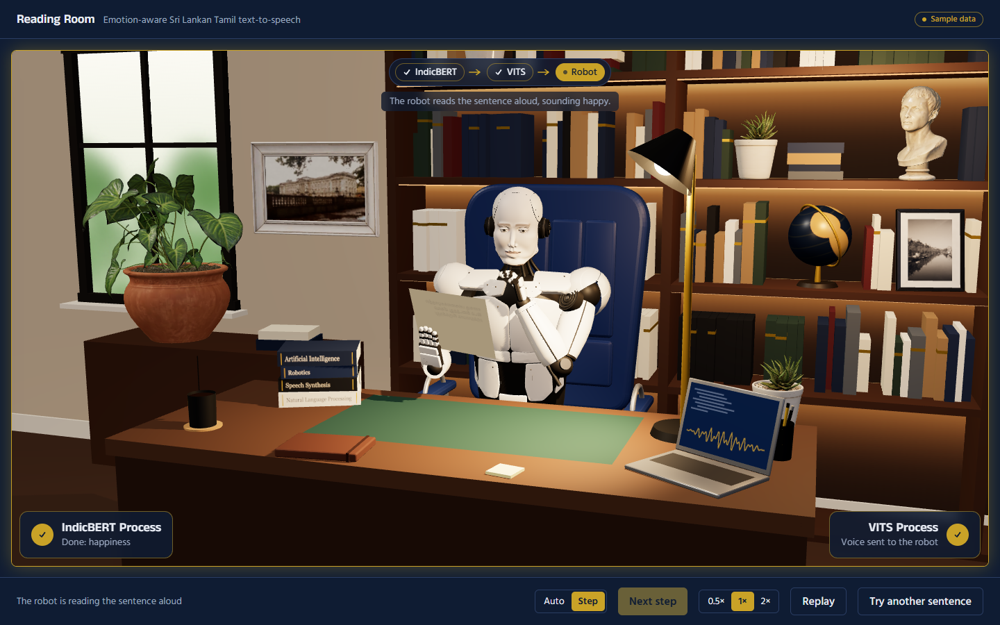

# Reading Room: Emotion-Aware Sri Lankan Tamil TTS demo

A demo dashboard for the research project **Emotion-Aware Sri Lankan Tamil Text-to-Speech Generation Using Automatic
Text-Based Emotion Prediction** (ITC4166, University of Sri Jayewardenepura).

You type a Sri Lankan Tamil sentence. **IndicBERT** reads it and predicts how it feels (neutral, happiness, sadness,
anger, fear). The **whole probability vector** goes to **VITS**, which speaks the sentence with that feeling. A 3D
robot in a study room reads the sentence aloud with lip-sync and a matching facial expression.

The dashboard explains every step of both models visually, so a supervisor or examiner can follow the research
pipeline from text to voice.



> **Sample data.** The trained models are not connected yet. The app makes realistic sample data with the same JSON
> shape the real Python backend will return, and every screen that shows sample numbers has a **Sample data** badge.
> See [How to connect the real models](#how-to-connect-the-real-models).

---

## Contents

- [Run it](#run-it)
- [How to use the demo](#how-to-use-the-demo)
- [What each screen shows](#what-each-screen-shows)
- [Keyboard shortcuts](#keyboard-shortcuts)
- [How to connect the real models](#how-to-connect-the-real-models)
- [API contract](#api-contract)
- [Try the API from the command line](#try-the-api-from-the-command-line)
- [Project structure](#project-structure)
- [Troubleshooting](#troubleshooting)
- [Credits](#credits)

---

## Run it

Needs **Node.js 20.9 or newer** (tested with Node 22) and a laptop browser with WebGL (Chrome or Edge).
The demo is designed for laptop screens (1280–1920 px wide).

```bash
npm install
npm run dev          # http://localhost:3000 (or the next free port)
```

For a presentation, use the production build, which is faster:

```bash
npm run build
npm run start        # http://localhost:3000
```

The first visit takes a second or two while the robot's face is built in the background.

---

## How to use the demo

1. **Type a sentence** in Sri Lankan Tamil (up to 300 characters), or click one of the **sample sentences**
   (one for each emotion).
2. **Choose a speaker** (`SPK01`–`SPK04`).
3. Click **Read aloud** (or press **Enter** in the text box).



The stage opens on the **robot screen**. The robot picks up the paper and reads it. Both models run by themselves in
the background:

- **IndicBERT** goes through its 10 steps.
- The five emotion values travel to **VITS** (a gold arrow shows the trip).
- VITS goes through its 8 steps.
- The voice travels into the robot, which speaks it.

At the top, a tracker (**IndicBERT → VITS → Robot**) lights up the part that is working now, with one line saying
what is happening.

To **watch a model at work**, click **IndicBERT Process** (bottom left) or **VITS Process** (bottom right). Its
screen slides over the robot and shows the current step. Click **Back to robot** or press **Esc** to return. The
process keeps running whether its screen is open or not.



### Presenter controls (bottom bar)

| Control | What it does |
| --- | --- |
| **Auto / Step** | Auto plays every step by itself. Step waits for you to press **Next step** for each one. |
| **Next step** | Shows the next step now (in Auto mode it skips the wait). |
| **0.5× / 1× / 2×** | Animation speed (the voice itself is never sped up). |
| **Replay** | Plays the whole run again with the same results (no new model calls). |
| **Try another sentence** | Back to the input screen. The sentence and speaker are kept. |

---

## What each screen shows

### IndicBERT: "Understanding" (10 steps)

| # | Step | What you see |
| --- | --- | --- |
| 1 | Input sentence | The sentence as typed |
| 2 | Normalisation | Before and after (Unicode NFC, spacing, numbers written as Tamil words) |
| 3 | Tokenisation | WordPiece tokens with their IDs (`[CLS]`, `##` pieces, `[SEP]`) |
| 4 | Token embeddings | Heatmap of the first 16 of the 768 values per token |
| 5 | Transformer encoder | 12 layers; last-layer attention map (hover or click a token to see what it looks at) |
| 6 | Sentence representation | The `[CLS]` vector (first 32 of 768 values) |
| 7 | Classification head | One raw score (logit) per emotion |
| 8 | Softmax | Scores turned into probabilities that add up to 1, animated |
| 9 | Predicted emotion | The top emotion with its confidence, and the full vector |
| 10 | Send to VITS | The exact JSON vector sent to VITS |





### VITS: "Speaking" (8 steps)

| # | Step | What you see |
| --- | --- | --- |
| 1 | Three inputs | Text, speaker and the 5 emotion values |
| 2 | Text to symbols | The characters VITS reads, grouped into Tamil letters |
| 3 | Conditioning | Two separate lanes: speaker embedding (table lookup) and emotion embedding (5 values → linear layer). Both feed the text encoder, duration predictor and decoder; they are never merged. |
| 4 | Text encoder | A sketch of the encoder's hidden states |
| 5 | Duration predictor | How long each character lasts, plus pitch, loudness and speaking rate |
| 6 | Alignment | Which character is spoken at each moment |
| 7 | Flow and decoder | Latent frames → decoder → waveform, and the spectrogram of the output voice |
| 8 | Output voice | Waveform player, **Play voice**, **Download voice** (`tts-{speaker}-{emotion}-{time}.wav`) |



### The robot speaking

When the voice arrives, the robot looks up and speaks it, with lip-sync from the playing audio. Its face, gestures
and the glowing core in its chest follow the predicted emotion, weighted by the whole probability vector.



---

## Keyboard shortcuts

| Key | Action |
| --- | --- |
| **Enter** | In the sentence box: Read aloud (**Shift + Enter** adds a new line) |
| **Space** or **→** | Next step |
| **R** | Replay |
| **Esc** | Close a process screen (back to the robot) |
| **Tab** | Move between controls (gold focus ring on dark areas, navy on white panels) |

Shortcuts are ignored while you type in the sentence box. With the system setting **Reduce motion** turned on,
packets fade in place instead of travelling, screens fade instead of sliding, and the robot's small idle movements
are turned off.

---

## How to connect the real models

The dashboard never talks to the models directly. The browser calls this app's API routes (`/api/emotion` and
`/api/tts`). Those routes either make sample data or forward the request to your Python backend:

```
Browser ──► /api/emotion ──► sample data             (MODEL_API_URL not set)
                         └─► ${MODEL_API_URL}/emotion (MODEL_API_URL set)
Browser ──► /api/tts     ──► sample data
                         └─► ${MODEL_API_URL}/tts
```

### Steps

1. **Build a small Python server** (for example FastAPI) with two endpoints:
   - `POST /emotion`
   - `POST /tts`

   Each takes and returns JSON exactly as in the [API contract](#api-contract) below.
2. **Point the dashboard at it.** Copy `.env.example` to `.env.local` and set:

   ```bash
   MODEL_API_URL=http://localhost:8000
   ```

3. **Restart** `npm run dev` (or rebuild for `npm run start`).

   The **Sample data** badges disappear: a reply without `"source"` counts as `"model"`.

You can check which one is active with `GET /api/health`, which returns `{"backend":"mock"}` or `{"backend":"model"}`.

**If the backend fails**, the dashboard returns HTTP 502 and shows a clear message on the robot screen with **Try
again** and **Try another sentence**. This happens when:

- it can't be reached;
- it doesn't answer within 30 seconds;
- it answers with an HTTP error;
- it sends JSON in the wrong shape. The message then names the fields that are wrong.

### A starting point for the backend

This outline shows where each field comes from. It is a sketch to adapt to your fine-tuned checkpoints, not tested
code.

```python
# server.py  (pip install fastapi uvicorn transformers torch numpy librosa soundfile)
import base64, io, time
import numpy as np, torch, librosa, soundfile as sf
from fastapi import FastAPI
from transformers import AutoTokenizer, AutoModelForSequenceClassification

EMOTIONS = ["neutral", "happiness", "sadness", "anger", "fear"]   # same order as the classifier's labels
app = FastAPI()

tok = AutoTokenizer.from_pretrained("path/to/your-finetuned-IndicBERTv2")
clf = AutoModelForSequenceClassification.from_pretrained(
    "path/to/your-finetuned-IndicBERTv2", output_attentions=True, output_hidden_states=True).eval()

@app.post("/emotion")
def emotion(body: dict):
    t0 = time.perf_counter()
    text = normalise(body["text"])                       # your NFC + number-to-words preprocessing
    t1 = time.perf_counter()
    enc = tok(text, return_tensors="pt")
    t2 = time.perf_counter()
    with torch.no_grad():
        out = clf(**enc)
    t3 = time.perf_counter()
    logits = out.logits[0]
    probs = torch.softmax(logits, -1)
    ids = enc["input_ids"][0].tolist()
    return {
        "normalizedText": text,
        "tokens": [{"token": t, "id": i} for t, i in zip(tok.convert_ids_to_tokens(ids), ids)],
        "embeddingPreview": out.hidden_states[0][0, :, :16].tolist(),       # tokens × 16
        "attention": out.attentions[-1][0].mean(0).tolist(),               # tokens × tokens, heads averaged
        "clsVectorPreview": out.hidden_states[-1][0, 0, :32].tolist(),     # first 32 of 768
        "logits": dict(zip(EMOTIONS, logits.tolist())),
        "probabilities": dict(zip(EMOTIONS, probs.tolist())),
        "predictedEmotion": EMOTIONS[int(probs.argmax())],
        "confidence": float(probs.max()),
        "timingsMs": {"normalize": (t1 - t0) * 1000, "tokenize": (t2 - t1) * 1000,
                      "encoder": (t3 - t2) * 1000, "classify": 0.1},
    }

@app.post("/tts")
def tts(body: dict):
    vector = torch.tensor([body["emotionVector"][e] for e in EMOTIONS])   # the FULL vector, not the label
    # Your emotion-conditioned VITS (from facebook/mms-tts-tam, fine-tuned). Return the internals it already computes:
    r = my_vits.synthesize(body["text"], speaker=body["speakerId"], emotion=vector)
    wav = r.audio                                                        # float32, 16 kHz
    buf = io.BytesIO(); sf.write(buf, wav, 16000, format="WAV", subtype="PCM_16")
    mel = librosa.power_to_db(librosa.feature.melspectrogram(y=wav, sr=16000, n_fft=1024, hop_length=256, n_mels=80))
    return {
        "inputSymbols": r.characters,                    # one Unicode character each
        "speakerEmbeddingPreview": r.speaker_embedding[:16].tolist(),
        "emotionEmbeddingPreview": r.emotion_embedding[:16].tolist(),   # after the linear projection
        "durations": r.durations.tolist(),               # frames per character (1 frame = 256 samples)
        "alignment": r.alignment.tolist(),               # characters × frames (downsample to ≤ 400 columns)
        "melSpectrogram": mel.tolist(),                  # 80 bins × frames (≤ 320 frames is plenty)
        "prosody": {"meanPitchHz": r.mean_f0, "pitchRange": r.f0_range,
                    "energy": r.energy, "speakingRate": r.chars_per_second},
        "audio": {"base64Wav": base64.b64encode(buf.getvalue()).decode(),
                  "sampleRate": 16000, "durationSec": len(wav) / 16000},
        "timingsMs": r.timings_ms,                       # textEncoder, durationPredictor, flow, decoder
    }
```

Run it with `uvicorn server:app --port 8000`.

---

## API contract

The single source of truth is [`src/lib/api/contracts.ts`](src/lib/api/contracts.ts) (zod schemas). The dashboard
checks every reply against it.

### `POST /emotion` (IndicBERT)

Request:

```json
{ "text": "எனக்கு பல்கலைக்கழகத்தில் இடம் கிடைத்தது, மிகவும் சந்தோசமாக இருக்கிறது!" }
```

Reply:

| Field | Type | Meaning |
| --- | --- | --- |
| `source` | `"mock"` \| `"model"` | Optional from the backend (missing = `"model"`) |
| `normalizedText` | string | Text after preprocessing |
| `tokens` | `{token, id}[]` | WordPiece (`##`) or SentencePiece (`▁`) tokens, including `[CLS]` / `[SEP]` |
| `embeddingPreview` | number[tokens][16] | First 16 embedding values per token |
| `attention` | number[tokens][tokens] | Last-layer attention, averaged over heads; each row adds up to 1 |
| `clsVectorPreview` | number[32] | First 32 values of the `[CLS]` vector |
| `logits` | `{neutral, happiness, sadness, anger, fear}` | Raw scores |
| `probabilities` | same keys, 0–1 | Softmax; must add up to 1 |
| `predictedEmotion` | one of the 5 | Top emotion |
| `confidence` | 0–1 | Its probability |
| `timingsMs` | `{normalize, tokenize, encoder, classify}` | Milliseconds |

### `POST /tts` (VITS)

Request (the dashboard sends the **full vector** and the normalised text):

```json
{
  "text": "எனக்கு பல்கலைக்கழகத்தில் இடம் கிடைத்தது, மிகவும் சந்தோசமாக இருக்கிறது!",
  "speakerId": "SPK02",
  "emotionVector": { "neutral": 0.07, "happiness": 0.82, "sadness": 0.04, "anger": 0.03, "fear": 0.04 },
  "predictedEmotion": "happiness"
}
```

Reply:

| Field | Type | Meaning |
| --- | --- | --- |
| `source` | `"mock"` \| `"model"` | Optional (missing = `"model"`) |
| `inputSymbols` | string[] | The characters the model reads, one Unicode character each |
| `speakerEmbeddingPreview` | number[] | First values of the speaker embedding |
| `emotionEmbeddingPreview` | number[] | First values of the projected emotion embedding |
| `durations` | number[symbols] | Frames per symbol |
| `alignment` | number[symbols][frames], 0–1 | Monotonic alignment (frames may be downsampled) |
| `melSpectrogram` | number[bins][frames] | Log-mel of the output audio, low to high frequency |
| `prosody` | `{meanPitchHz, pitchRange, energy, speakingRate}` | Summary numbers |
| `audio` | `{base64Wav, sampleRate, durationSec}` | The voice as a base64 WAV (16 kHz for MMS-TTS) |
| `timingsMs` | `{textEncoder, durationPredictor, flow, decoder}` | Milliseconds |

### Errors

Bad input gets **HTTP 400**; a failing backend gets **HTTP 502**. Both use this shape:

```json
{ "error": { "code": "BAD_REQUEST", "message": "Write the sentence in Tamil script.", "issues": [{ "path": "text", "message": "…" }] } }
```

---

## Try the API from the command line

Example request bodies are in [`examples/`](examples). Send JSON from a file: on Windows, Tamil typed straight into
a command line turns into `?`. In PowerShell, type `curl.exe` instead of `curl`.

```bash
curl http://localhost:3000/api/health
curl -X POST http://localhost:3000/api/emotion -H "Content-Type: application/json" --data-binary "@examples/emotion-request.json"
curl -X POST http://localhost:3000/api/tts -H "Content-Type: application/json" --data-binary "@examples/tts-request.json"
curl -i -X POST http://localhost:3000/api/emotion -H "Content-Type: application/json" --data-binary "@examples/bad-request.json"   # 400
```

Save the sample voice as a WAV file (PowerShell):

```powershell
$r = Invoke-RestMethod -Method Post -Uri http://localhost:3000/api/tts -ContentType "application/json" -InFile examples/tts-request.json
[IO.File]::WriteAllBytes("$PWD\voice.wav", [Convert]::FromBase64String($r.audio.base64Wav))
```

To use your own recorded voices for the sample data, put `SPK01.wav` … `SPK04.wav` in `public/mock-audio/`.

---

## Project structure

```
src/
  app/                    page, layout, global styles, API routes (api/emotion, api/tts, api/health)
  lib/api/                contracts.ts (zod schemas), client.ts (browser fetch), server.ts (proxy + errors)
  lib/mock/               deterministic sample data (same sentence → same result)
  lib/audio/              one shared audio element + analyser (player, Play voice and lip-sync)
  store/pipelineStore.ts  the run's state machine (zustand)
  components/
    input/                sentence box, speaker buttons, sample sentences
    stage/                stage layout, tracker + process buttons, signal packets, presenter controls, director
    indicbert/            the 10 IndicBERT steps
    vits/                 the 8 VITS steps and the audio player
    ui/                   shared parts (step cards, process screen, heatmap, bars, buttons)
    robot/                the 3D robot (parts, face, motion, lip-sync) and room/ (study room and desk props)
public/models/            3D props from Poly Haven (CC0)
docs/screenshots/         the pictures in this README
examples/                 request bodies for curl
```

| Command | What it does |
| --- | --- |
| `npm run dev` | Development server |
| `npm run build` | Production build |
| `npm run start` | Run the production build |
| `npm run lint` | ESLint |

Add `?debug=1` to the URL for the robot's debug tools (camera angles, FPS meter, scene and face tests).

---

## Troubleshooting

| Problem | Fix |
| --- | --- |
| "The 3D robot needs WebGL…" | Turn on hardware acceleration in the browser settings. The rest of the demo still works. |
| No sound | Browsers can block sound that starts by itself. Click **Play voice** (it pulses when this happens). |
| "The emotion model did not respond…" | The Python backend isn't running or `MODEL_API_URL` is wrong. Start it, or remove `MODEL_API_URL` to use sample data. |
| "…not in the agreed JSON shape" | Compare the backend reply with the [API contract](#api-contract); the message lists the wrong fields. |
| The robot moves slowly | Check the FPS with `?debug=1`. Use the production build and a laptop with a graphics card. |

---

## Credits

- 3D props (plants, marble bust, picture frames) from [Poly Haven](https://polyhaven.com), CC0. Details in
  [`public/models/CREDITS.md`](public/models/CREDITS.md).
- Models referenced: [`ai4bharat/IndicBERTv2-MLM-only`](https://huggingface.co/ai4bharat/IndicBERTv2-MLM-only) and
  [`facebook/mms-tts-tam`](https://huggingface.co/facebook/mms-tts-tam).
- Fonts: Anek Tamil and Hind Madurai (Google Fonts).
- Built with Next.js, React Three Fiber, GSAP, Motion, zustand, zod and wavesurfer.js.
